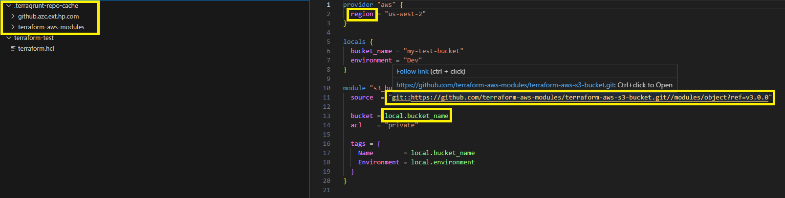

# Navigation for Terraform and Terragurunt codes

### How to use
- Recognized paths will be underlined
- Hover the mouse over the path to check the resolved path
- Use `Ctrl+Click` OR `F12` to navigate to that file/folder
- Recognized keys and values will be shown in different color
- Hover the mover over the key/value to get the resolved value

